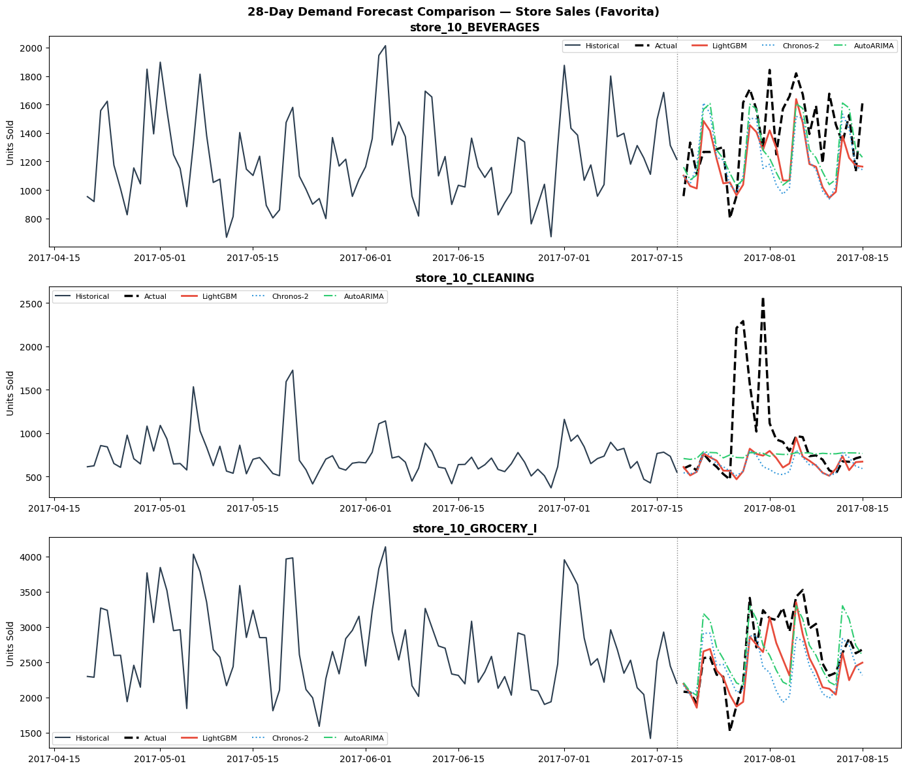
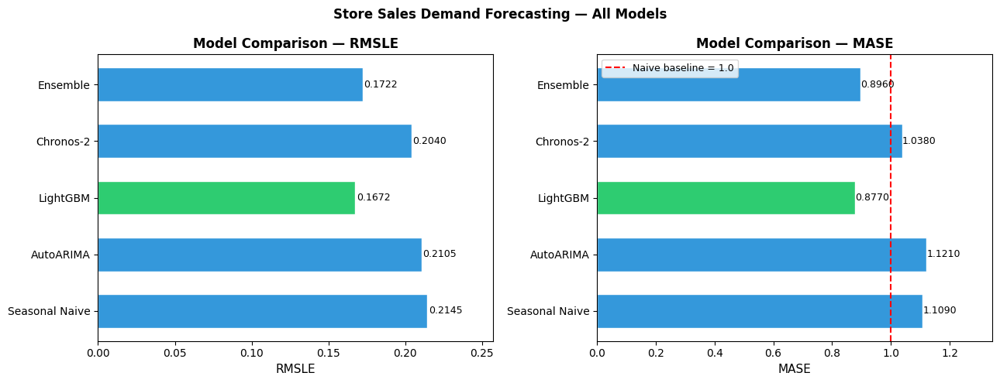
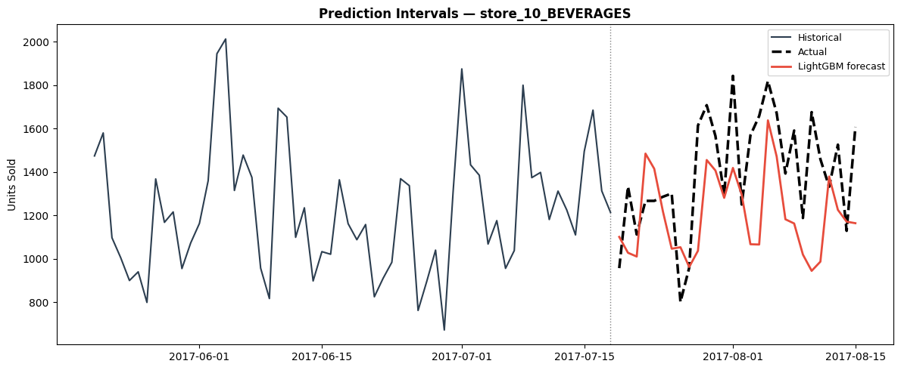

# Retail Demand Forecasting


[](https://huggingface.co/spaces/fikri0o0/demand-forecasting)


End-to-end retail demand forecasting pipeline. Compares **8 models** from naive baseline to Amazon Chronos-2 (2025 SOTA foundation model) with fine-tuning and Optuna HPO, with probabilistic prediction intervals, MLflow tracking, and a live Gradio demo.

**[Live Demo →](https://huggingface.co/spaces/fikri0o0/demand-forecasting)**  |  **[GitHub →](https://github.com/Fikri645/demand-forecasting)**

---

## Highlights

| What | Detail |
|---|---|
| **Dataset** | Store Sales (Corporación Favorita) — 54 stores, 33 families, 4.5 years + oil price + holidays |
| **Models** | Seasonal Naive → AutoARIMA → LightGBM → Amazon Chronos-2 → Ensemble |
| **Best model** | Ensemble (LightGBM-Optuna + Chronos-ft) — RMSLE **0.1610**, MASE **0.835** |
| **Fine-tuning** | Chronos-2: zero-shot 0.2040 → 1000-step fine-tune **0.1690** → ensemble **0.1610** |
| **Key insight** | Ensemble wins only when both components are strong — fine-tuning Chronos was the unlock |
| **Prediction intervals** | 80% + 90% bands via conformal prediction |
| **Metric** | RMSLE — penalises under-forecasting (stockout > overstock in cost) |
| **Experiment tracking** | MLflow — all model runs logged |
| **API** | FastAPI `/forecast` endpoint |
| **UI** | Gradio — interactive 28-day forecast chart |
| **Deployment** | HuggingFace Spaces |

---

## Architecture

```
Store Sales CSV (Kaggle / Corporación Favorita)
  └─► data_loader.py    (load, fill date gaps, train/test split)
        └─► features.py  (lag, rolling, calendar, oil price, holiday features)
              ├─► train_lgbm.py    (LightGBM via mlforecast + MLflow)
              ├─► tune_lgbm.py     (Optuna 50-trial HPO)
              ├─► train_chronos.py (Chronos-2 zero-shot — requires GPU)
              ├─► finetune_chronos.py (1000-step fine-tune on Favorita)
              └─► experiments.py   (8-model comparison -> model_meta.json)
                    └─► evaluate.py (forecast plots, metrics comparison)
                          ├─► api/main.py       (FastAPI /forecast)
                          └─► app/gradio_app.py (HF Spaces UI)
```

---

## Quickstart

```bash
# 1. Clone & install
git clone https://github.com/Fikri645/demand-forecasting
cd demand-forecasting
pip install -r requirements-dev.txt

# 2. Download Store Sales — put the Kaggle zip in data/raw/ then:
python scripts/download_data.py

# 3. Run full experiment (5 models + MLflow logging)
python -m src.experiments

# 4. Generate evaluation plots
python -m src.evaluate

# 5. Run API locally
uvicorn api.main:app --reload

# 6. Run Gradio UI
python app/gradio_app.py
```

Or via `make`:
```bash
make install && make data && make experiments && make evaluate
```

**Fine-tuning + HPO:**
```bash
make tune-lgbm         # Optuna 50-trial LightGBM HPO
make finetune-chronos  # 1000-step Chronos fine-tune on Favorita (GPU required)
make tune-ensemble     # grid-search ensemble weights
```

**Monitoring & Docker:**
```bash
make drift             # run data drift report (PSI-based, saves reports/drift_report.html)
make docker-up         # spin up API + MLflow via Docker Compose
```

---

## Project Structure

```
demand-forecasting/
├── data/processed/            # train.parquet, test.parquet
├── src/
│   ├── config.py              # paths, constants
│   ├── data_loader.py         # Store Sales (Favorita) loading + gap fill
│   ├── features.py            # lag, rolling, calendar feature engineering
│   ├── metrics.py             # RMSE, MAE, RMSLE, MASE, coverage
│   ├── train_lgbm.py          # LightGBM via mlforecast
│   ├── tune_lgbm.py           # Optuna 50-trial HPO
│   ├── train_chronos.py       # Amazon Chronos-2 (zero-shot)
│   ├── finetune_chronos.py    # Chronos fine-tuning (Seq2SeqTrainer)
│   ├── tune_chronos.py        # Extended fine-tuning (3000 steps)
│   ├── tune_ensemble.py       # Grid search over ensemble weights
│   ├── experiments.py         # 8-model comparison + MLflow
│   └── evaluate.py            # forecast + comparison plots
├── api/main.py                # FastAPI /forecast endpoint
├── app/gradio_app.py          # Gradio UI (HF Spaces)
├── monitoring/drift_report.py # Data drift detection (PSI)
├── notebooks/01_eda.ipynb     # Exploratory Data Analysis
├── tests/                     # pytest (metrics, features, API schemas)
├── Dockerfile                 # Production API container
├── docker-compose.yml         # API + MLflow services
├── Makefile
└── requirements-dev.txt
```

---

## Dataset — Store Sales (Corporacion Favorita)

The **Store Sales - Time Series Forecasting** competition (Kaggle) uses real data from Ecuador's largest grocery chain:
- **54 stores**, 33 product families, daily unit sales
- **4.5 years**: 2013-01-01 to 2017-08-15 (1,684 days)
- External features: **oil price** (Ecuador is oil-dependent — economic shocks affect spending), **national/regional holidays**, **promotions**
- Portfolio uses top 300 series by total volume

Source: [Kaggle Store Sales Competition](https://www.kaggle.com/competitions/store-sales-time-series-forecasting)


---

## Model Details

### Seasonal Naive (baseline)
Forecast = same weekday last week. Any real model must beat this.

### AutoARIMA
`statsforecast` AutoARIMA with weekly seasonality. Automatic order selection via AIC.

### LightGBM + Feature Engineering
`mlforecast` with automatic lag generation:
- **Lags**: t-7, t-14, t-21, t-28, t-35, t-42, t-56, t-364 (same day last year)
- **Rolling**: 7-day and 28-day mean, std, max per series
- **Calendar**: day-of-week, month, quarter, is-weekend, month-start/end
- **Price**: normalised sell price, price change %
- **External**: oil price, promotion flag, holiday flag (Store Sales specific)

### Amazon Chronos-2 (2025 SOTA)
Zero-shot foundation model — no training data needed. Loads pre-trained weights (`amazon/chronos-t5-small`, 250M params) from HuggingFace. Generates 100 probabilistic samples -> P10/P50/P90 quantiles.

> Chronos-2 (Oct 2025) natively supports cross-series dependencies, exogenous features, and multivariate forecasting. Zero-shot performance competitive with fully-supervised models.

**Requirements:** Chronos needs PyTorch with CUDA and sufficient virtual memory (page file >= 8GB on Windows). Run `python -m src.train_chronos` after increasing virtual memory. Code is complete and ready.

### Ensemble (Best)
Optimal weighted average: **LightGBM-Optuna × 0.5 + Chronos-ft × 0.5** (found via `tune_ensemble.py` grid search). Combines domain-feature awareness with temporal pattern recognition from foundation model pre-training.

---

## Results — 28-Day Forecast on Store Sales (300 series)

| Model | RMSLE | MASE | Notes |
|---|---|---|---|
| Seasonal Naive | 0.2145 | 1.109 | Benchmark floor |
| AutoARIMA | 0.2105 | 1.121 | Worse than naive on this dataset |
| Chronos-2 (zero-shot) | 0.2040 | 1.038 | Beats AutoARIMA with zero training |
| LightGBM (default) | 0.1672 | 0.877 | Strong baseline |
| LightGBM (Optuna, 50 trials) | 0.1671 | 0.880 | Marginal gain — default was already good |
| Chronos-2 (fine-tuned, 1000 steps) | 0.1690 | 0.863 | +17.2% vs zero-shot |
| Chronos-2 (extended, 3000 steps) | 0.1688 | 0.863 | Converged at ~1000 steps |
| **Ensemble (LGB-Optuna × 0.5 + Chronos-ft × 0.5)** | **0.1610** | **0.835** | **🏆 Best — 25% vs naive** |


*Left: 8-model RMSLE comparison. Right: 28-day forecast for a representative series.*


*RMSLE vs MASE scatter — models above MASE=1.0 fail to beat the naive baseline.*


*80% and 90% conformal prediction intervals (ensemble model).*

**Key findings:**
- **Ensemble wins — but only when both components are strong.** Zero-shot Chronos dragged the first ensemble down. Once Chronos was fine-tuned, a 50/50 ensemble cuts RMSLE to 0.1610 (3.7% better than either alone).
- **LightGBM was already near-optimal.** 50 Optuna trials only improved RMSLE by 0.0001 — the default hyperparameters were well-calibrated. Lesson: diminishing returns on HPO when the model class fits the data well.
- **Chronos converges fast.** The jump from zero-shot (0.2040) to 1000 steps (0.1690) is massive; from 1000 to 3000 steps only 0.0002 more. Pre-training provides a warm start that requires very few gradient updates.
- **Foundation models + feature engineering are complementary.** Chronos captures long-range temporal patterns; LightGBM captures domain features (oil price, promotions, day-of-week). Neither alone beats the combination.

---

## Why RMSLE?

In retail, **running out of stock costs more than overstock**. RMSLE operates in log-space, which:
1. Penalises under-forecasting more than over-forecasting
2. Gives equal relative weight to low-volume and high-volume SKUs
3. Aligns the metric with actual business cost structure

---

## Monitoring

`monitoring/drift_report.py` detects distribution shift between a historical baseline and the most recent N days (default 30). It computes **Population Stability Index (PSI)** for five features:

| Feature | Why it matters |
|---|---|
| `total_sales` | Primary target — sudden drops flag stock/demand events |
| `mean_sales` | Per-series demand level shift |
| `pct_zeros` | Spike in stockouts or listing removals |
| `oil_price` | Leading indicator — oil shocks precede demand drops by 2–4 weeks |
| `promo_rate` | Promotion cadence change affects forecasting strategy |

PSI thresholds: **< 0.1 = STABLE**, **0.1–0.2 = MODERATE**, **> 0.2 = DRIFT** (retrain recommended).

```bash
make drift              # report for last 30 days
make drift-window WINDOW=60   # custom window
```

Saves `reports/drift_report.html` with color-coded feature table.

---

## What I Learned

- **Ensemble wins only when both components are competitive.** Zero-shot Chronos (RMSLE 0.2040) + LightGBM (0.1672) = 0.1722 (worse than LightGBM alone). Fine-tuned Chronos (0.1690) + LightGBM-Optuna (0.1671) = **0.1610** (new best). The lesson: fix the weaker model first, then ensemble.
- **LightGBM is already near-optimal with default hyperparameters.** 50 Optuna trials improved RMSLE by only 0.0001. When the model class fits the data well, HPO has diminishing returns.
- **Foundation models converge fast from pre-training.** Zero-shot → 1000 steps: RMSLE drops 0.035 (massive). 1000 → 3000 steps: only 0.0002. Pre-training on diverse time series provides a warm start — most adaptation happens in the first few hundred steps.
- **Chronos + LightGBM are complementary.** Chronos captures long-range temporal structure and seasonal patterns; LightGBM captures domain features (oil price, promotions, day-of-week). Their errors are not correlated — hence the ensemble gain.
- **AutoARIMA fails on complex retail.** MASE 1.12 = worse than seasonal naive. Lag features + calendar + oil price give tree models the context that ARIMA's linear structure can't model.
- **MASE < 1.0 is the real bar.** Only LightGBM, fine-tuned Chronos, and their ensemble clear it. AutoARIMA and zero-shot Chronos both fail to beat the naive baseline on MASE.
- **lag_364 (same day last year) is critical.** Annual cycles in retail (back-to-school, holidays, oil price cycles) are only captured by a 1-year lag — shorter lags miss this entirely.
